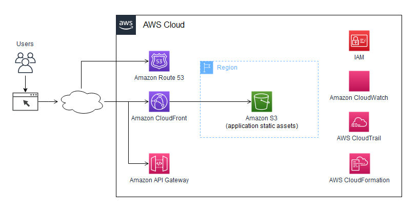

<div id="top"></div>

![Contributors][contributors-shield]

![Pull Request || AWS CodeCommit][pull-request-shield]

![Issues][issues-shield]

<!-- PROJECT LOGO -->
<br />
<div align="center">
  <a href="https://github.com/yuzukicat/cloudfront-s3-actions-react">
    
  </a>

  <h3 align="center">React deploy to S3 with Cloudfront CDN create resources using Cloudformation</h3>

  <p align="center">
    <br />
    <a href="https://github.com/yuzukicat/cloudfront-s3-actions-react"><strong>Cloudfront S3 Actions React »</strong></a>
    <br />
    <br />
    <a href="https://github.com/yuzukicat/cloudfront-s3-actions-react/issues">Report Issue</a>
    ·
    <a href="https://github.com/yuzukicat/cloudfront-s3-actions-react/pulls">Pull Request</a>
  </p>
</div>

<!-- TABLE OF CONTENTS -->
<details>
  <summary>Table of Contents</summary>
  <ol>
    <li>
      <a href="#about-the-project">About The Project</a>
      <ul>
        <li><a href="#built-with">Built With</a></li>
      </ul>
    </li>
    <li>
      <a href="#getting-started">Getting Started</a>
      <ul>
        <li><a href="#prerequisites">Prerequisites</a></li>
        <li><a href="#installation">How To</a></li>
      </ul>
    </li>
    <li><a href="#roadmap">Roadmap</a></li>
    <li><a href="#contributing">Contributing</a></li>
    <li><a href="#contact">Contact</a></li>
    <li><a href="#acknowledgments">Acknowledgments</a></li>
  </ol>
</details>

<!-- ABOUT THE PROJECT -->
## About The Project

[![React deploy to S3 with Cloudfront CDN create resources using Cloudformation][product-screenshot]](./cloudfront-s3-actions-react.png)   

Auto deploy react SPA to AWS S3 using github actions, and a Cloudformation template to auto initialize S3, Cloudfront resources in aws.   

<p align="right">(<a href="#top">back to top</a>)</p>

### Built With

* [AWS CloudFormation | S3 | CloudFront](https://docs.aws.amazon.com/prescriptive-guidance/latest/patterns/deploy-a-react-based-single-page-application-to-amazon-s3-and-cloudfront.html)
* [Github Actions | actions/checkout@v3](https://github.com/actions/checkout)
* [Github Actions | aws-actions/configure-aws-credentials@v1](https://github.com/aws-actions/configure-aws-credentials)

<p align="right">(<a href="#top">back to top</a>)</p>

<!-- GETTING STARTED -->
## Getting Started

### Prerequisites

* An active AWS account.
* Bucket restrictions and limitations not excess 100. Or you may need to remove unused S3 buckets. If you need additional buckets, submit a support ticket to increase your limit. However, there is a hard limit of 1000 S3 buckets per account. See [AWS S3 | Bucket restrictions and limitations](https://docs.aws.amazon.com/AmazonS3/latest/userguide/BucketRestrictions.html)

### How To

1. Clone the repo
```sh
git clone https://github.com/yuzukicat/cloudfront-s3-actions-react
```

2. Floder Premission.
```sh
cd ..
sudo chmod -R 777 cloudfront-s3-actions-react
cd cloudfront-s3-actions-react
```

3. To Create the infrastructure to host and expose a React Single Page Application:   
Deploy the AWS CloudFormation template.   
See [AWS Rrescriptive Guidance | Websites & web apps](https://docs.aws.amazon.com/prescriptive-guidance/latest/patterns/deploy-a-react-based-single-page-application-to-amazon-s3-and-cloudfront.html)
- Epics
  - Deploy the SPA
    - Deploy the AWS CloudFormation template: Change the option as follow:
- Stack failure options
  - Preserve successfully provisioned resources
**Your may need to try rollback and redeploy stack for CFDistribution because it asyncs CDN resources across aws network and takes long time up to half an hour.**

4. Set up ENV for CD.
See [Github Actions | Actions secrets](https://github.com/Azure/actions-workflow-samples/blob/master/assets/create-secrets-for-GitHub-workflows.md)

5. Edit **react-build-deploy-s3.yml**
Spefic the branch to be trigged by push action.   
See [Github Actions | actions/checkout@v3](https://github.com/actions/checkout)   
Spefic the aws region.   
See [Amazon Elastic Compute Cloud | Networking in Amazon EC2 | Regions and Zones](https://docs.aws.amazon.com/AWSEC2/latest/UserGuide/using-regions-availability-zones.html)   
Spefic the the dist folder and s3 bucketname(not logic output name for cloudfromation).   

6. Git Remote remove origin and Add to you own origin, git push. The public folder will be auto deploy to s3.

7. If you get React router issue on AWS Cloudfront and S3 | React router CloudFront access denied | S3 not found, See  
[React router issue on AWS Cloudfront and S3 | React router CloudFront access denied | 2022 Fix | Newest](https://docs.aws.amazon.com/AWSEC2/latest/UserGuide/using-regions-availability-zones.html)   
If you get **The If-Match version is missing or not valid for the resource.** error when updating custom error pages, try **Incognito Window**   

8. For nocache settings, See   
[AmazonCloudFront | Invalidating files](https://docs.aws.amazon.com/AWSEC2/latest/UserGuide/using-regions-availability-zones.html)   
Also refer to the article to see **Configure default cache behavior**   
[Continuous Deployment Pipeline for React App on AWS S3 + CloudFront](https://thepaulo.medium.com/continuous-deployment-pipeline-for-react-app-on-aws-s3-cloudfront-ac60f455642a)   

<p align="right">(<a href="#top">back to top</a>)</p>

<!-- ROADMAP -->
## Roadmap

- [ ] Fix **You have attempted to create more buckets than allowed** issue resulting in rollback and deployment failure during cloudformation stack deployment.(A tool to delete unused buckets)

See the [open issues](https://github.com/yuzukicat/cloudfront-s3-actions-react/issues) for a full list of proposed features (and known issues).

<p align="right">(<a href="#top">back to top</a>)</p>

<!-- CONTRIBUTING -->
## Contributing

If you are familar with github actions, CI/CD or AWS, you are welcome to join and development automated deployment tools

1. Clone the Project
2. Create your Feature Branch (`git checkout -b feature/AmazingFeature`)
3. Commit your Changes (`git commit -m 'Add some AmazingFeature'`)
4. Push to the Branch (`git push origin feature/AmazingFeature`)
5. Open a Pull Request

Emails:

<p align="right">(<a href="#top">back to top</a>)</p>

<!-- CONTACT -->
## Contact

Yuzuki.Cat - yuzuki.cat@kamisu66.com

Project Link: [https://github.com/yuzukicat/cloudfront-s3-actions-react](https://github.com/yuzukicat/cloudfront-s3-actions-react)

<p align="right">(<a href="#top">back to top</a>)</p>

<!-- ACKNOWLEDGMENTS -->
## Acknowledgments

Please share useful links here for reference.

* [Code OSS Plugin | aws-cloudformation-yaml](https://marketplace.visualstudio.com/items?itemName=DanielThielking.aws-cloudformation-yaml)

<p align="right">(<a href="#top">back to top</a>)</p>

<!-- MARKDOWN LINKS & IMAGES -->
<!-- https://www.markdownguide.org/basic-syntax/#reference-style-links -->
[contributors-shield]: https://img.shields.io/github/contributors/othneildrew/Best-README-Template.svg?style=for-the-badge
[contributors-url]: https://eyesjapan.atlassian.net/jira/software/projects/FOODAI/boards/231
[pull-request-shield]: https://img.shields.io/github/forks/othneildrew/Best-README-Template.svg?style=for-the-badge
[pull-request-url]: https://github.com/yuzukicat/cloudfront-s3-actions-react/pulls
[issues-shield]: https://img.shields.io/github/issues/othneildrew/Best-README-Template.svg?style=for-the-badge
[issues-url]: https://github.com/yuzukicat/cloudfront-s3-actions-react/issues
[license-shield]: https://img.shields.io/github/license/othneildrew/Best-README-Template.svg?style=for-the-badge
[product-screenshot]: ./cloudfront-s3-actions-react.png
